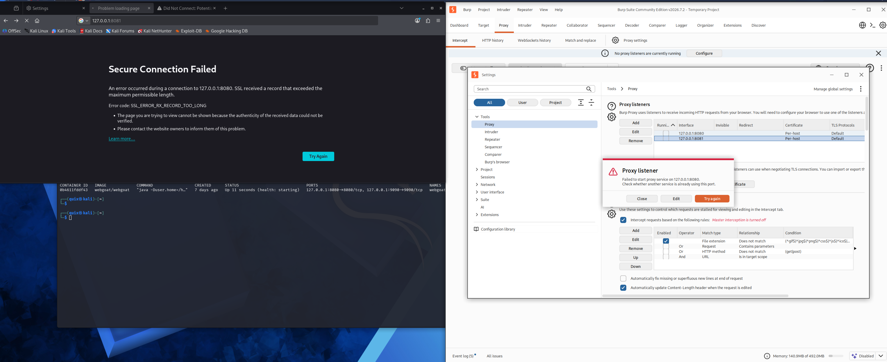
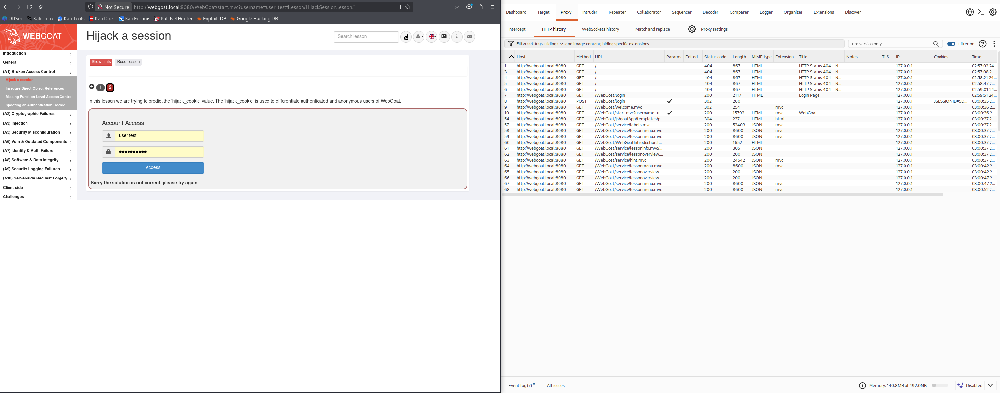
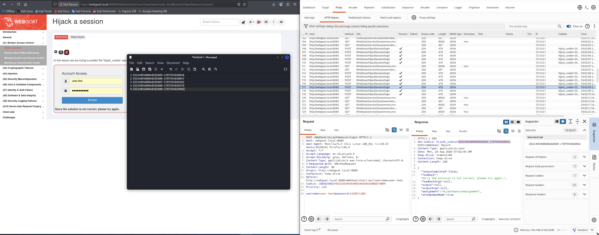
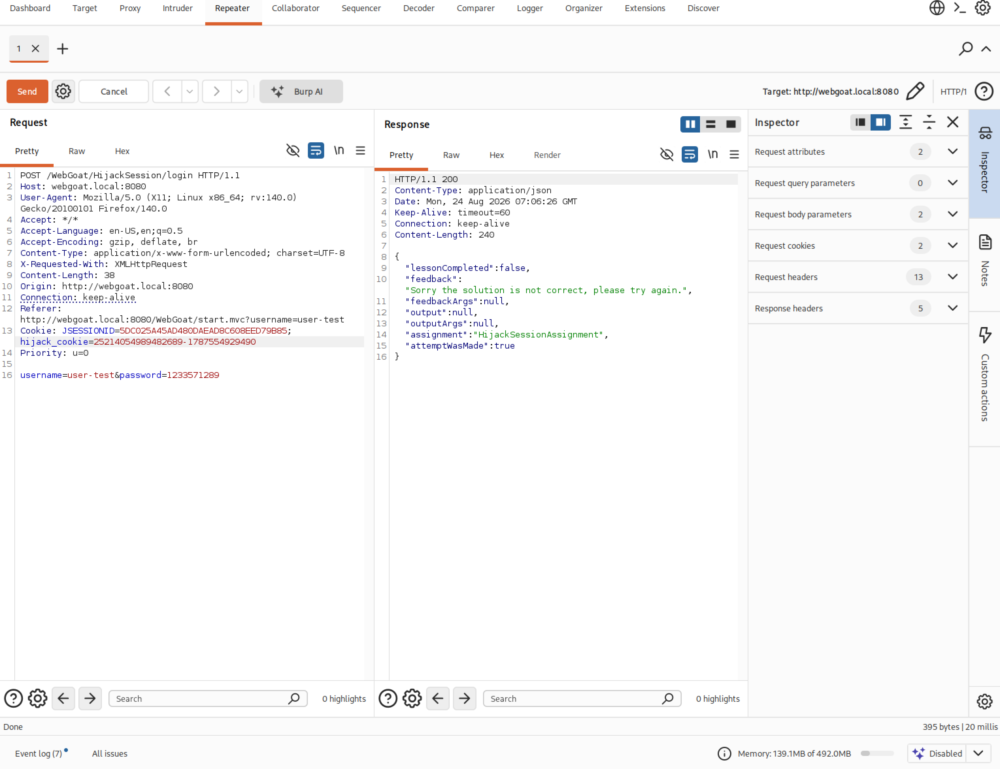
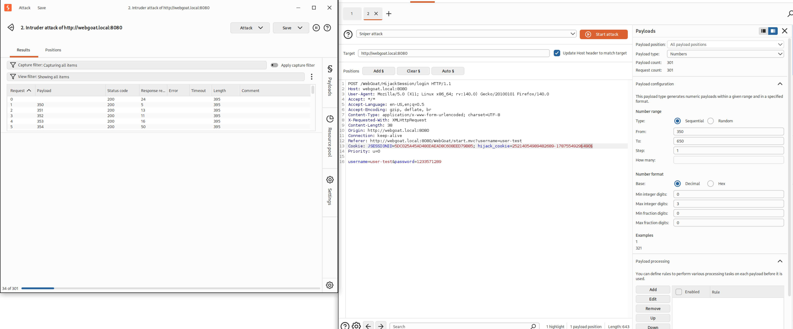
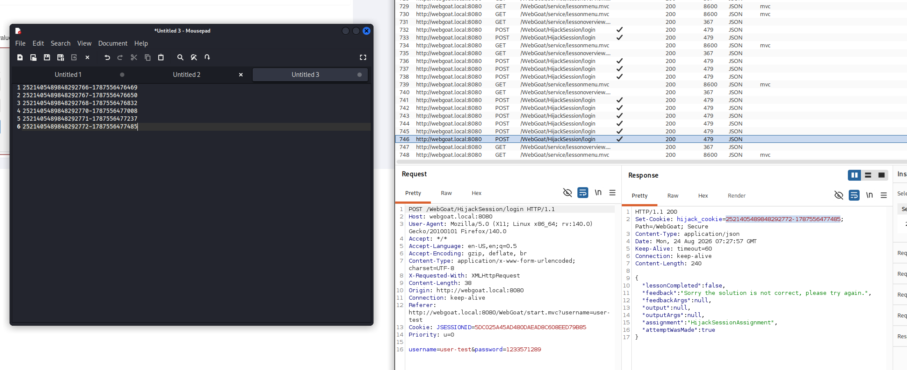
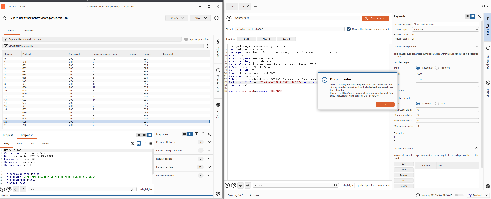
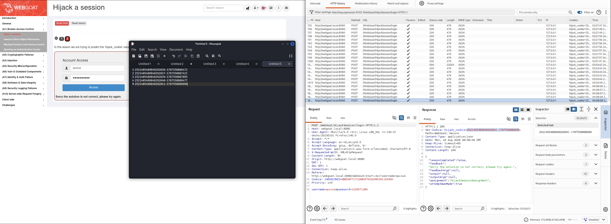
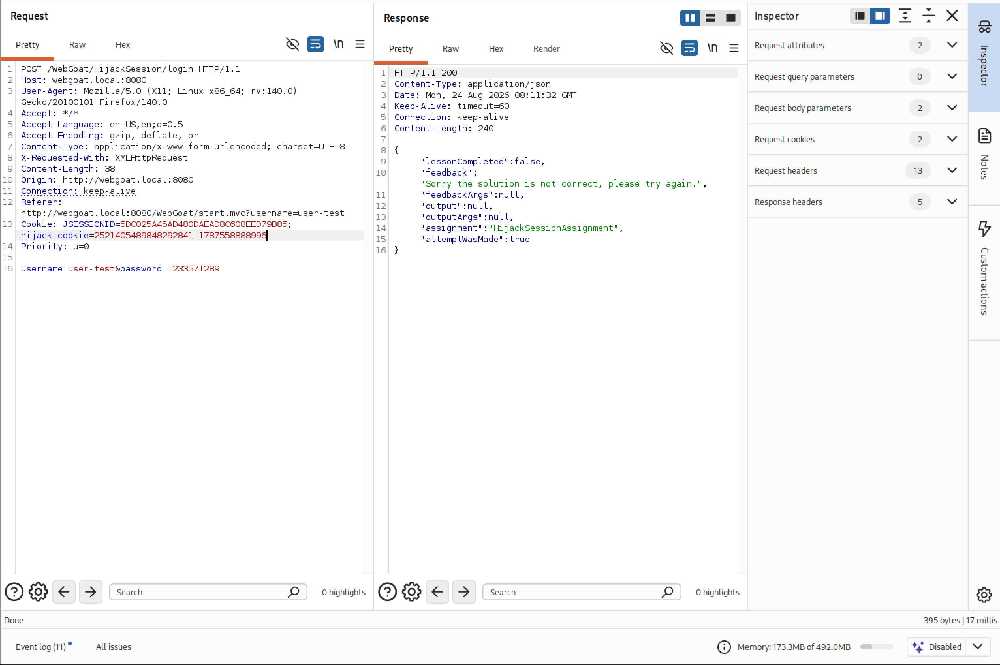
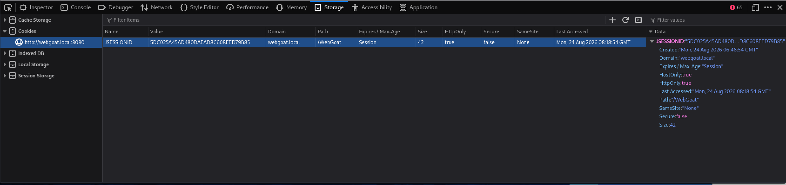

# A01 Broken Access Control - Hijack a session

**Середовище:** Kali Linux, Docker (WebGoat container), Burp Suite Community Edition
**Дата:** 24.08.2026
**Статус:** Завдання виконувалось методологічно правильно, проте фінального успіху (зеленої позначки) досягти не вдалося. Нижче детально задокументовано хід роботи, застосовані техніки та висновки щодо причин.

## Мета

Отримати доступ до автентифікованої сесії, що належить іншому користувачу, шляхом передбачення значення кукі `hijack_cookie`, яке складається з номера сесії та часової мітки (timestamp).

## Середовище

- WebGoat запущено в Docker-контейнері, порти прив'язані до `127.0.0.1:8080`.
- Через обмеження Firefox (з'єднання до `localhost`/`127.0.0.1` ніколи не проксуються) для роботи з Burp Suite використано локальний alias `webgoat.local` → `127.0.0.1` через `/etc/hosts`.
- Burp Suite Proxy listener на `127.0.0.1:8081`, у Firefox налаштовано ручний проксі на цю адресу.



## Хід роботи

### 1. Підключення та перехід до уроку

Залогинились як `user-test`, перейшли в (A1) Broken Access Control → Hijack a session, крок 2.



### 2. Збір послідовності hijack_cookie

Кілька разів натиснули «Access» з довільними обліковими даними. У Burp → Proxy → HTTP history знайшли запити `POST /WebGoat/HijackSession/login` та виписали значення `hijack_cookie` з відповіді (`Set-Cookie`) в текстовий редактор:

```
2521405489848292685-1787554928636
2521405489848292686-1787554928947
2521405489848292687-1787554929162
2521405489848292688-1787554929379
2521405489848292690-1787554929602
```

Помітили пропуск у послідовності номерів: **689 відсутній**. За аналогією до формату (перша частина - номер сесії, друга - timestamp), спробували «передбачити» це значення.



### 3. Спроба через Repeater з обчисленою міткою часу

Обчислили приблизну (інтерпольовану) мітку часу між сусідніми значеннями (768 і 770) та підставили в запит вручну через Burp Repeater.



Результат: `"Sorry the solution is not correct, please try again."`

### 4. Автоматизований перебір мітки часу через Intruder

Оскільки точна мітка вручну не вгадується, запустили Burp Intruder (Sniper attack) з перебором останніх 3 цифр мітки часу в широкому діапазоні (кілька сотень запитів).



Результат: усі відповіді мали однакову довжину (395 байт) - жодного влучання.

### 5. Повторний збір з новим пропуском (689 → 769)

Скинули послідовність, зібрали нову партію значень - новий пропуск виявився на числі **769**. Повторили спроби обчисленої мітки та ширшого перебору (діапазон 750–1090) - знову без результату.



### 6. Перебір лише номера сесії зі старою міткою (за методом з референсного прикладу)

За зразком методики з референсного репозиторію викладача спробували варіювати **лише номер сесії**, залишаючи мітку часу незмінною (взятою від іншого реального значення). Швидкий перебір діапазону 680–700.



Результат: також безуспішно (21 запит, усі однакової довжини).

### 7. Створення другого реального користувача (паралельна сесія)

Висунули гіпотезу, що потрібна **справді чужа** активна сесія, а не вгадане значення. Відкрили приватне вікно Firefox, зареєстрували другого користувача (`quixus`) з окремим `JSESSIONID`, і згенерували його власні значення `hijack_cookie`.



### 8. Крос-сесійний тест

Взяли точне (реальне, щойно видане) значення `hijack_cookie` користувача `quixus` та підставили його в запит користувача `user-test` через Repeater.



Результат: також `"Sorry the solution is not correct"`, навіть з абсолютно реальним, щойно виданим чужим значенням.

### 9. Перевірка кукі-сховища браузера

Додатково перевірили сховище кукі браузера (DevTools → Storage → Cookies) - виявили, що `hijack_cookie` там **відсутній взагалі**, лише `JSESSIONID`. Це може бути пов'язано з атрибутом `Secure` у `Set-Cookie` за відсутності HTTPS-з'єднання, хоча це навряд чи впливає на результати тестів через Repeater (де кукі формуються вручну, незалежно від збереження в браузері).




