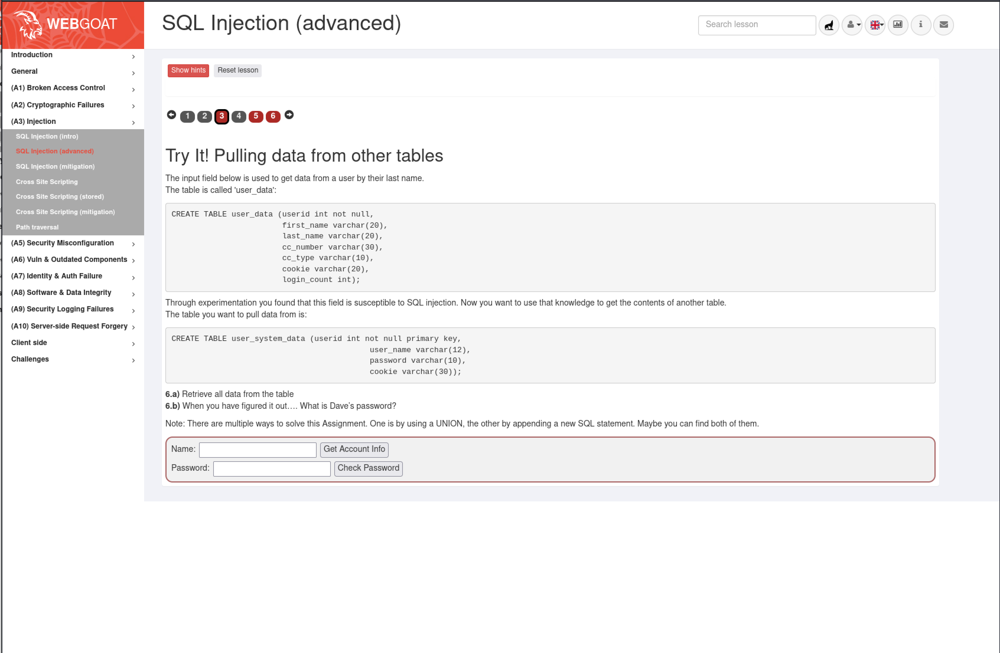
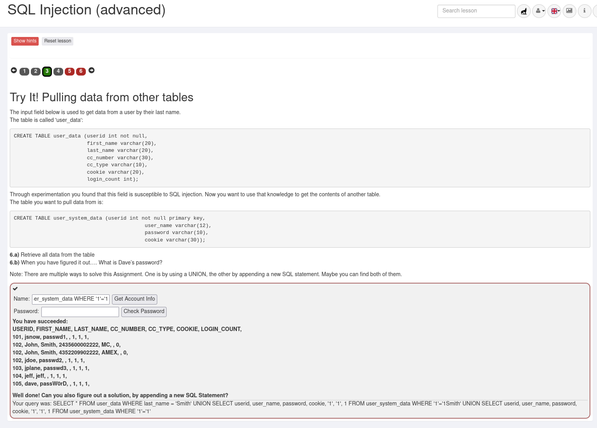
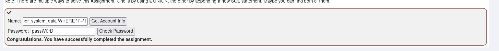
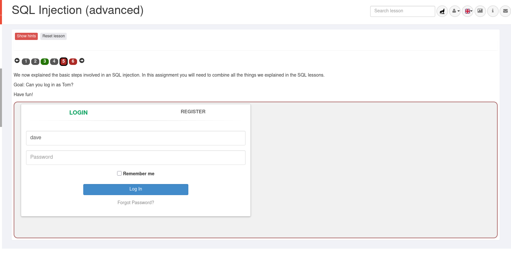

# A03 Injection - SQL Injection (advanced)

**Середовище:** Kali Linux, Docker (WebGoat container), Burp Suite Community Edition
**Дата:** 24.08.2026

## Мета

Ознайомитися з механізмом SQL-ін'єкцій: навчитися експлуатувати вразливе поле вводу для отримання даних з інших таблиць бази даних (UNION-based SQL injection) та спробувати обійти автентифікацію.

## Середовище

WebGoat запущено в Docker-контейнері, доступ через `http://webgoat.local:8080` (локальний alias, налаштований раніше в `/etc/hosts`), перехоплення трафіку - Burp Suite Proxy.

## Хід роботи

### 1. Задача: отримати дані з іншої таблиці (крок 3)

Дано вразливе поле пошуку користувача за прізвищем у таблиці `user_data`. Потрібно, використовуючи цю вразливість, отримати вміст іншої таблиці - `user_system_data` (містить `user_name`, `password`, `cookie`) - і, зокрема, дізнатись пароль користувача Dave.



**Аналіз:** таблиця `user_data` має 7 колонок (`userid, first_name, last_name, cc_number, cc_type, cookie, login_count`), отже `UNION SELECT` повинен повертати теж 7 значень для коректного об'єднання результатів.

**Використаний payload** (поле Name):

```sql
Smith' UNION SELECT userid, user_name, password, cookie, '1', '1', 1 FROM user_system_data WHERE '1'='1
```

Логіка: справжній запит виглядає як `SELECT * FROM user_data WHERE last_name = 'INPUT'`. Символ `'` закриває оригінальний рядковий літерал, `UNION SELECT` під'єднує вибірку з таблиці `user_system_data` (4 реальні колонки + 3 колонки-заповнювачі, щоб зійшлась кількість). Замість коментаря `--` (який у цій збірці WebGoat/HSQLDB не спрацював коректно - сервер повертав помилку `malformed string`) використано трюк із **балансуванням лапок**: наприкінці інʼєкції додано `WHERE '1'='1`, а лапку, яку сервер сам дописує в кінці рядка, використано для закриття цього виразу (`'1'='1'` - завжди істинна умова).



**Результат:**

```
USERID, FIRST_NAME, LAST_NAME, CC_NUMBER, CC_TYPE, COOKIE, LOGIN_COUNT,
101, jsnow, passwd1, , 1, 1, 1,
102, John, Smith, 2435600002222, MC, , 0,
102, John, Smith, 4352209902222, AMEX, , 0,
102, jdoe, passwd2, , 1, 1, 1,
103, jplane, passwd3, , 1, 1, 1,
104, jeff, jeff, , 1, 1, 1,
105, dave, passW0rD, , 1, 1, 1,
```

**Пароль Dave: `passW0rD`**

Завдання також запропонувало знайти другий спосіб - через додавання пароля в поле Password (`passW0rD`) і кнопку Check Password - це також підтвердило успішне виконання.



Вкладка кроку 3 змінила колір з червоного на зелений - завдання зараховано.

### 3. Крок 5: спроба обходу автентифікації (Can you log in as Tom?)



Підказка уроку: *"Look at the different response you receive from the server when you try different entries"* - натякає на порівняння відповідей сервера для різних вводів (класичний прийом виявлення SQL-ін'єкції).

**Випробувані підходи:**
- `Tom' --` та варіації з пробілами навколо коментаря
- `Tom' OR '1'='1` (balanced quotes без коментаря)
- Одинарна лапка `'` окремо - для перевірки, чи змінюється повідомлення про помилку
- Ін'єкція в поле Password замість Name (`' OR '1'='1`)
- Різний регістр імені користувача (`tom` замість `Tom`)
- Посилання «Forgot Password?» - виявилось нефункціональним (декоративний елемент)

**Результат:** у всіх випадках сервер повертав однакове повідомлення `"Wrong username or password. Try again."`, без жодної зміни поведінки - навіть при заві domомо некоректному SQL-синтаксисі (одинарна лапка), що зазвичай спричиняє помилку синтаксису при справжній вразливості.


