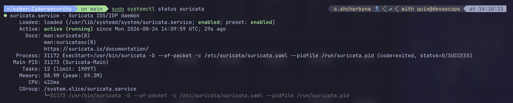
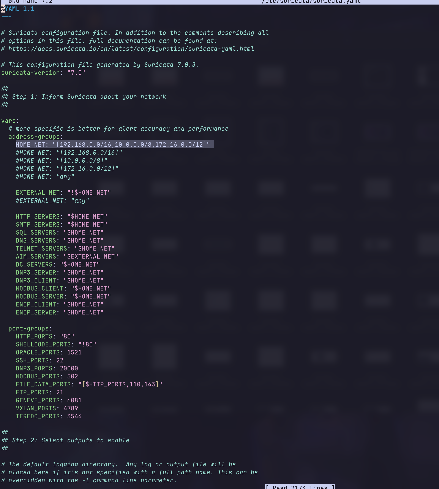
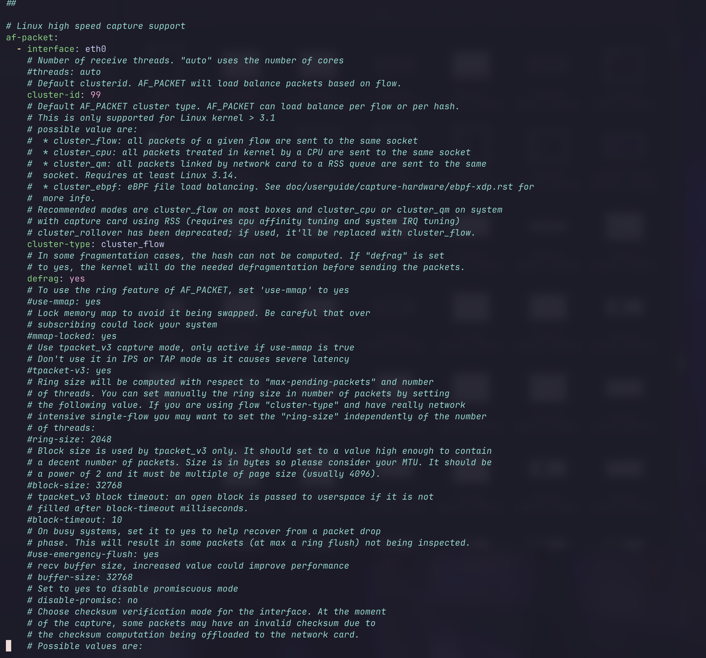
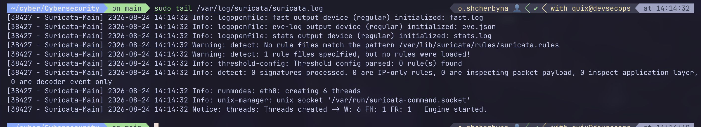
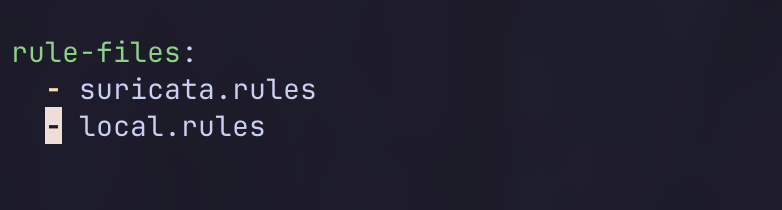
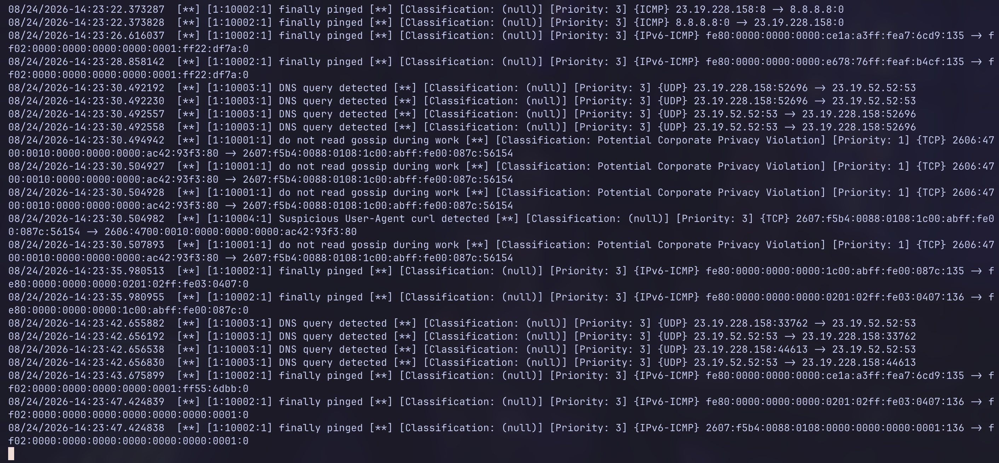

# Звіт: Suricata IDS/IPS - встановлення та власні правила

**Середовище:** Ubuntu (хмарна VM), пакетний менеджер apt
**Дата:** 24.08.2026

Я встановив і налаштував Suricata IDS/IPS за прикладом з презентації, перевірив спрацювання стандартного правила та додав власні правила (2 з прикладу + 2 свої).

## Крок 1-2. Встановлення Suricata

Ставив прямо з репозиторію (окремий PPA не знадобився, пакет вже був у репозиторії системи):

```bash
sudo apt update
sudo apt install -y suricata jq
```

Перевірив версію та статус:

```bash
sudo suricata --build-info
sudo systemctl status suricata
```

Suricata встановилась версії **7.0.3**, служба одразу активна (`Active: active (running)`).



## Крок 3. Налаштування конфігурації

Відкрив конфіг:

```bash
sudo nano /etc/suricata/suricata.yaml
```

Перевірив змінну `HOME_NET` - стандартні приватні діапазони вже покривали мою мережу, змінювати нічого не довелось:



Перевірив секцію `af-packet` - інтерфейс вже правильно вказував на мій робочий інтерфейс `eth0` (дізнався його раніше командою `ip a`):



## Крок 4. Встановлення сигнатур (правил)

```bash
sudo suricata-update
```

Suricata завантажила набір правил Emerging Threats Open - **68409 правил**, з них увімкнено 52468. Перевірка конфігурації пройшла успішно (`Testing with suricata -T. Done.`).

## Крок 5. Запуск Suricata з правилами

```bash
sudo systemctl restart suricata
sudo tail /var/log/suricata/suricata.log
```

У логу видно, що двигун успішно запустився і почав обробляти пакети на `eth0`:



## Крок 6. Перевірка спрацювання стандартного правила

Відкрив живий перегляд лога алертів в одному терміналі:

```bash
sudo tail -f /var/log/suricata/fast.log
```

У другому терміналі виконав тестовий запит, спеціально призначений для перевірки IDS:

```bash
curl http://testmynids.org/uid/index.html
```

У логу одразу з'явився алерт:

```
[**] [1:2100498:7] GPL ATTACK_RESPONSE id check returned root [**]
[Classification: Potentially Bad Traffic] [Priority: 2] {TCP}
```

Це підтвердило, що Suricata реально аналізує трафік і правила працюють.

## Крок 7-9. Створення власних правил

Створив файл з правилами:

```bash
sudo nano /var/lib/suricata/rules/local.rules
```

Записав туди 4 правила - перші два взяв з прикладу презентації, ще два додав сам:

```
alert http any any -> any any (msg: "do not read gossip during work"; flow: to_client, established; classtype: policy-violation; sid: 10001; rev: 1;)
alert icmp any any -> any any (msg: "finally pinged"; sid: 10002; rev: 1;)
alert dns any any -> any any (msg: "DNS query detected"; sid: 10003; rev: 1;)
alert http any any -> any any (msg: "Suspicious User-Agent curl detected"; flow: to_server, established; http.user_agent; content: "curl"; nocase; sid: 10004; rev: 1;)
```

Що роблять мої два додаткові правила:
- **sid: 10003** - ловить будь-який DNS-запит у мережі (просто для демонстрації, як бачити DNS-трафік у алертах)
- **sid: 10004** - ловить HTTP-запити з User-Agent, що містить слово "curl" (типова ознака автоматизованих/скриптованих запитів, а не звичайного браузера)

Прописав файл у конфіг Suricata:

```bash
sudo nano /etc/suricata/suricata.yaml
```

У секції `rule-files` додав `local.rules`:



## Крок 10. Перезапуск і перевірка завантаження правил

```bash
sudo systemctl restart suricata
sudo tail /var/log/suricata/suricata.log
```

У логу з'явився рядок:

```
2 rule files processed. 52472 rules successfully loaded, 0 rules failed
```

Було 52468 стандартних правил, стало 52472 - різниця рівно 4, тобто всі мої правила завантажились без помилок.

## Крок 11. Перевірка спрацювання власних правил

Знову відкрив живий перегляд лога:

```bash
sudo tail -f /var/log/suricata/fast.log
```

В іншому терміналі протестував кожне правило:

```bash
ping -c 4 8.8.8.8
curl -A "curl/7.68.0" http://example.com
nslookup example.com
```

Усі чотири правила спрацювали:

```
[1:10001:1] do not read gossip during work
[1:10002:1] finally pinged
[1:10003:1] DNS query detected
[1:10004:1] Suspicious User-Agent curl detected
```



## Висновок

Встановив Suricata IDS/IPS з нуля, налаштував конфігурацію під свою мережу та інтерфейс, завантажив стандартний набір сигнатур і переконався, що вони справді ловлять підозрілий трафік (тестовий запит на testmynids.org). Потім написав чотири власних правила - два з прикладу презентації і два свої (для DNS-запитів і для виявлення User-Agent curl), і перевірив, що всі вони коректно спрацьовують при відповідному трафіку. Робота повністю відтворює приклад з презентації плюс виконує вимогу додати два власних правила.
