# Звіт з практичної роботи: Соціальна інженерія

**Тема:** Створення фішингової сторінки за допомогою Social-Engineer Toolkit (SET)
**Дата виконання:** 16.08.2026

## Мета роботи

Відтворити в ізольованому лабораторному середовищі сценарій фішингової атаки з використанням Social-Engineer Toolkit (SET): згенерувати клоновану сторінку автентифікації Google, перехопити тестові облікові дані, надіслані через форму входу, та задокументувати кожен крок процесу.

## Опис середовища

| Параметр | Значення |
|---|---|
| Атакуюча машина | Kali Linux (віртуальна машина) |
| Інструмент | Social-Engineer Toolkit (SET) версії 8.0.3, кодова назва «Maverick» |
| Ціль атаки (клонована сторінка) | Google Sign-in (`https://www.google.com`) |
| IP-адреса для прийому POST-запитів | `192.168.149.128` (внутрішня адреса лабораторної VM) |
| Порт Credential Harvester | 80 |

Робота виконувалась виключно в ізольованому навчальному середовищі (лабораторна VM), без розсилки посилання реальним користувачам. Мета практично відпрацювати механіку атаки для подальшого розпізнавання та протидії подібним технікам.

## Хід виконання

### 1. Спроба запуску без прав root

Перша спроба запустити `setoolkit` під звичайним користувачем (`quix`) завершилась помилкою — SET вимагає прав root і завершує роботу, якщо їх немає.

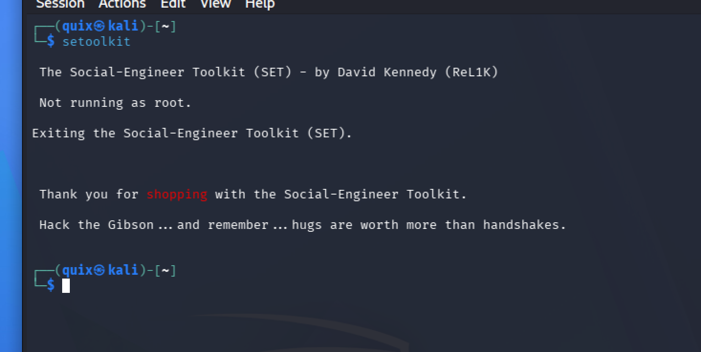

**Виправлення:** запуск через `sudo setoolkit`.

### 2. Запуск SET через sudo та головне меню

Після запуску з `sudo` SET успішно стартував. Виведено банер з версією (8.0.3, «Maverick») та головне меню з 6 пунктами.

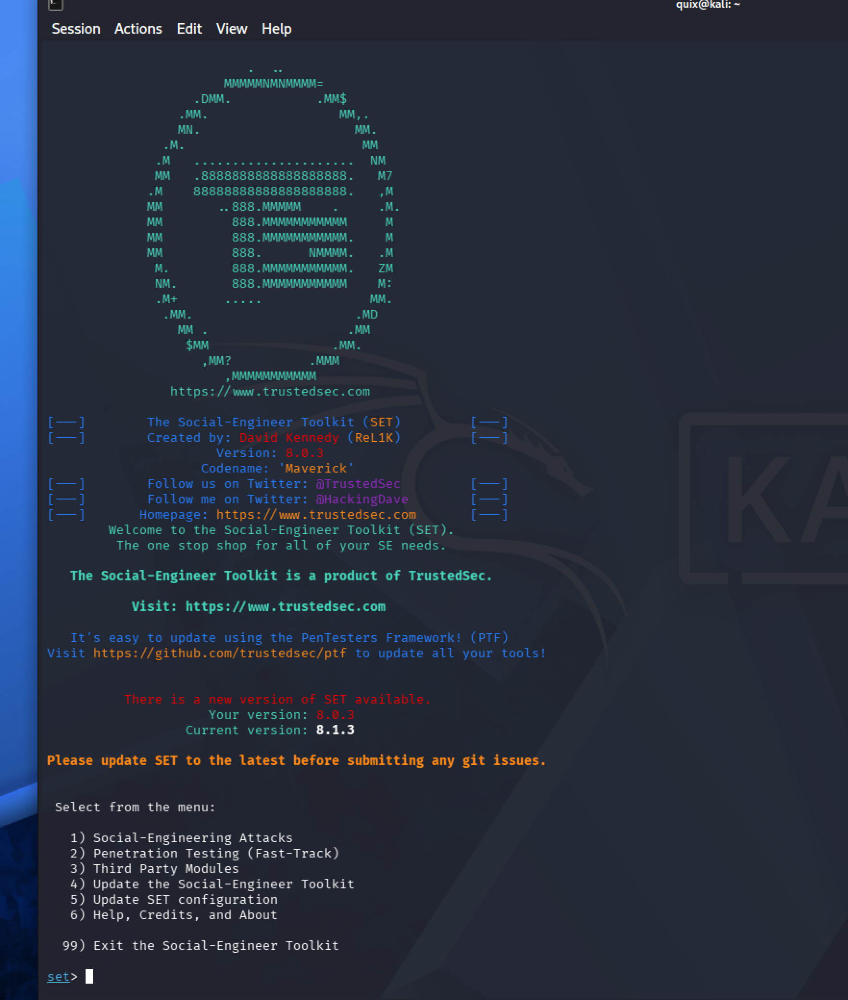

### 3. Social-Engineering Attacks

У головному меню обрано пункт **1 — Social-Engineering Attacks**.

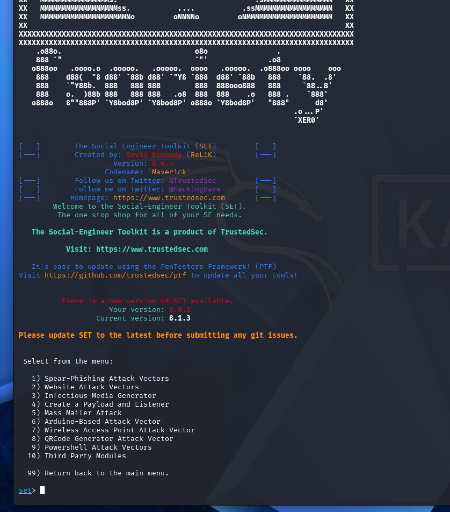

### 4. Помилковий вибір (Infectious Media Generator)

На цьому кроці помилково введено **3** замість **2**, що призвело до переходу в модуль **Infectious Media Generator** (створення інфікованих USB/CD/DVD) — це не той вектор, що потрібен для фішингу.

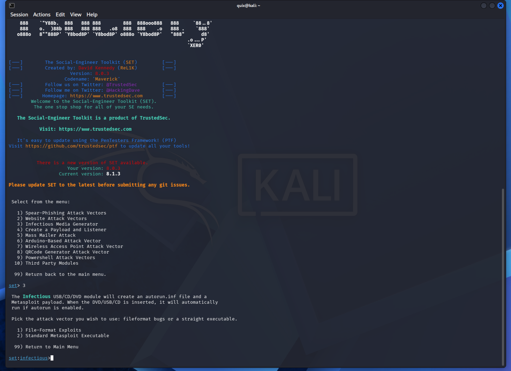

**Виправлення:** повернення в головне меню командою `99`.

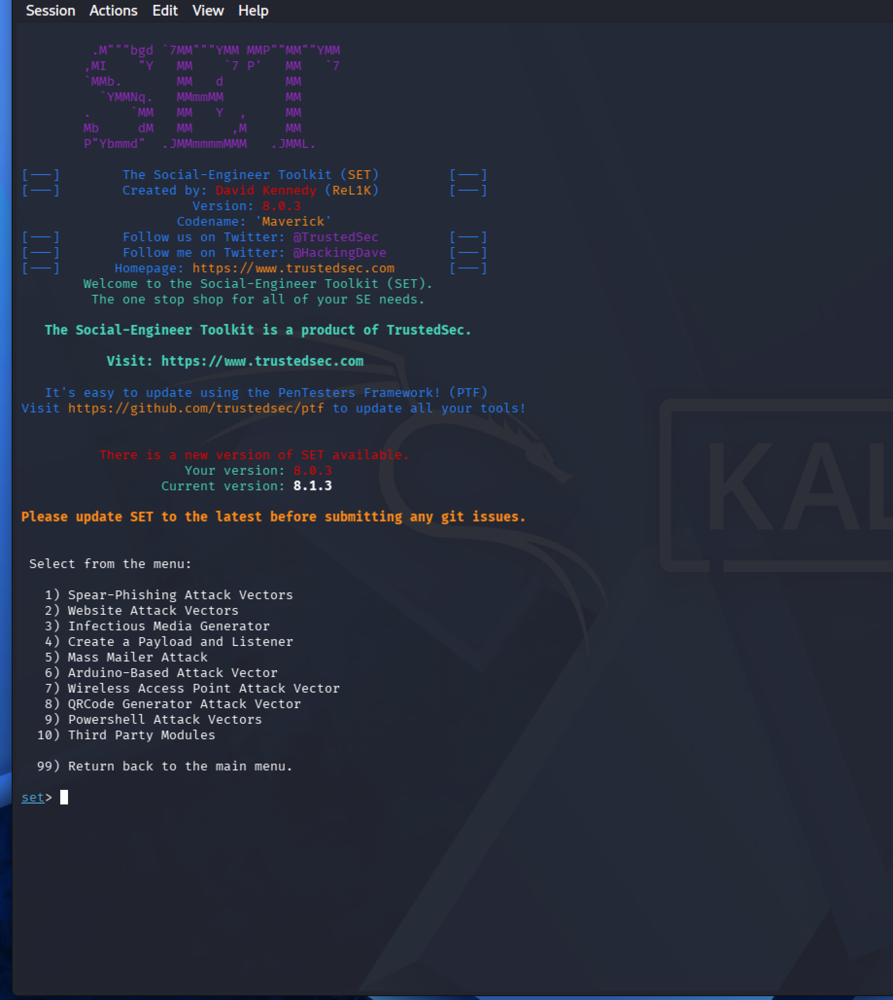

### 5. Website Attack Vectors

Повторно обрано **1  Social-Engineering Attacks**, а потім, цього разу коректно, **2  Website Attack Vectors**.

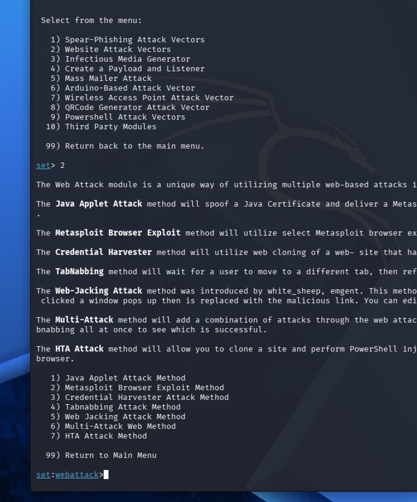

### 6. Credential Harvester Attack Method + Web Templates

У меню Website Attack Vectors обрано **3  Credential Harvester Attack Method**, а далі  **1 — Web Templates** (готовий шаблон, без клонування довільного сайту).

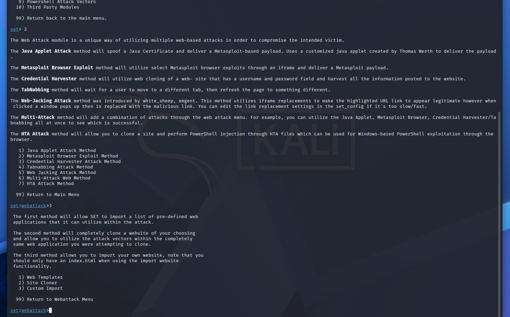

### 7. Вказання IP для прийому даних

SET запропонував IP-адресу для прийому POST-запитів (Harvester/Tabnabbing) зі значенням за замовчуванням `192.168.149.128` — це реальна внутрішня адреса лабораторної VM. Значення прийнято (Enter).

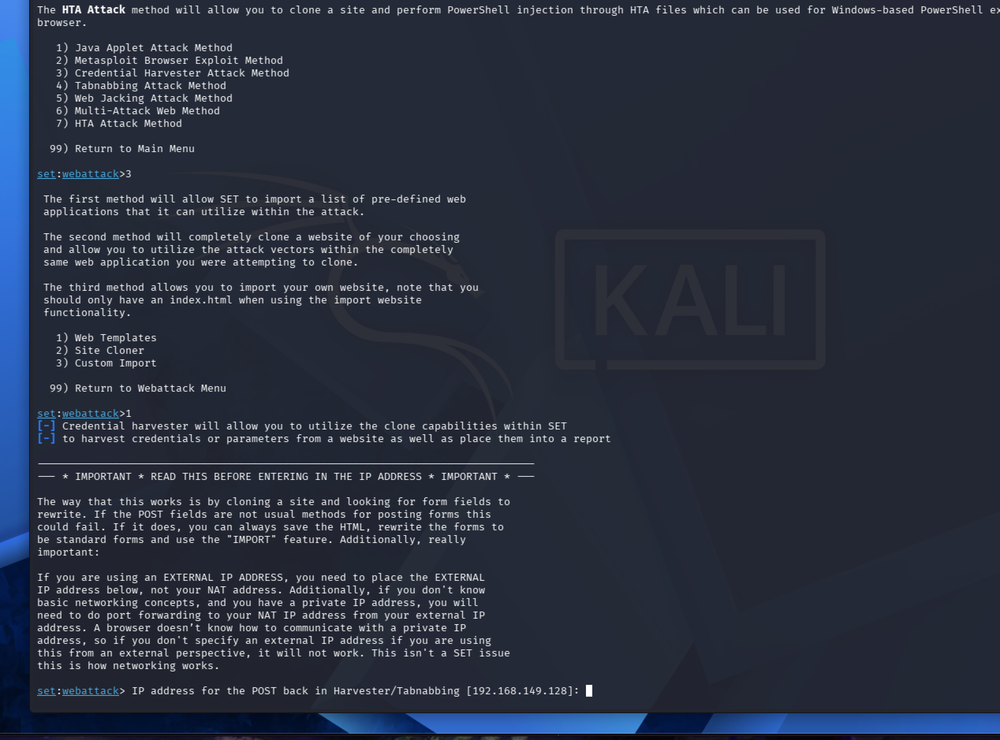

### 8. Вибір шаблону Google

Зі списку шаблонів (Java Required / Google / Twitter) обрано **2 — Google**. SET склонував сторінку `http://www.google.com` та підняв Credential Harvester на порту 80.

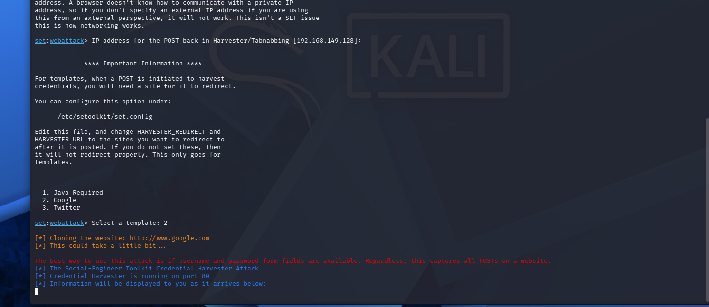

### 9. Відкриття підробленої сторінки в браузері

У браузері Kali відкрито `http://192.168.149.128`  відображається сторінка входу, візуально ідентична Google (включно з title вкладки «Sign in  Google Accounts»), з позначкою браузера «Not Secure» (оскільки немає TLS).

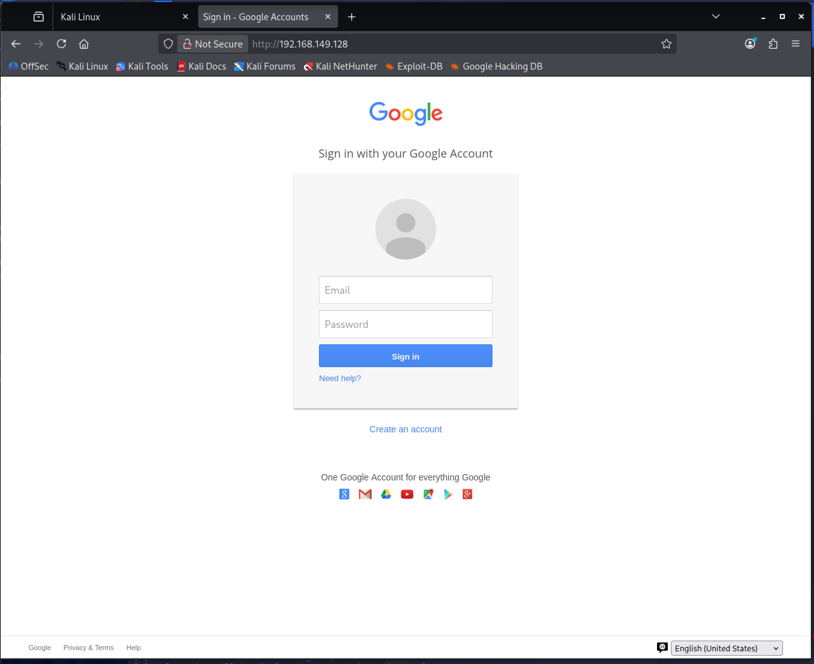

### 10. Введення тестових облікових даних

Введено тестові дані (`test@gmail.com` / короткий тестовий пароль) та натиснуто «Sign in».

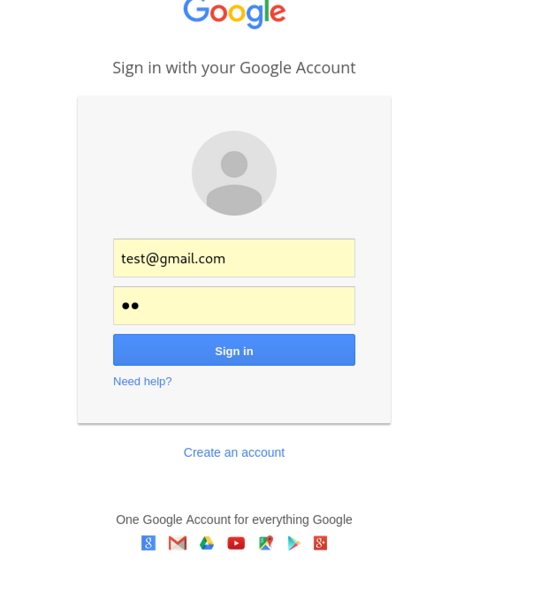

Після натискання «Sign in» браузер було автоматично перенаправлено на справжній сайт Google — це очікувана поведінка Credential Harvester: дані вже перехоплені до редиректу, і жертва не помічає підміни.

### 11. Перехоплення даних у терміналі SET

У терміналі SET двічі зафіксовано подію **«WE GOT A HIT!»** з повним списком параметрів POST-запиту. Серед них інструмент автоматично розпізнав поля форми:

```
POSSIBLE USERNAME FIELD FOUND: Email=test@gmail.com
POSSIBLE PASSWORD FIELD FOUND: Passwd=12
```

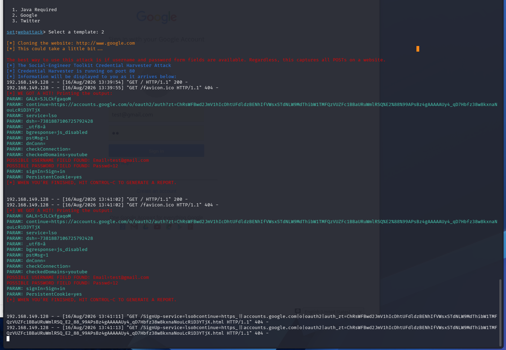

Це підтверджує, що фішингова сторінка успішно перехопила дані, введені у форму атака в лабораторних умовах досягла мети.

## Висновки

У ході роботи послідовно відтворено сценарій фішингової атаки з використанням SEToolkit: розгорнуто клоновану сторінку автентифікації Google на лабораторній VM (`192.168.149.128`), локально прийнято та зафіксовано тестові облікові дані, введені у підроблену форму.

Практична робота наочно демонструє, наскільки просто технічно підготовлена фішингова сторінка може бути невідрізненою від оригіналу для звичайного користувача, і чому базова гігієна (перевірка URL та сертифіката, менеджери паролів прив'язані до домену, двофакторна автентифікація) є критично важливою протидією подібним атакам.

Усі дії виконувались у ізольованому середовищі (`192.168.149.128`, лабораторна VM), без взаємодії з реальними користувачами чи сервісами Google.
